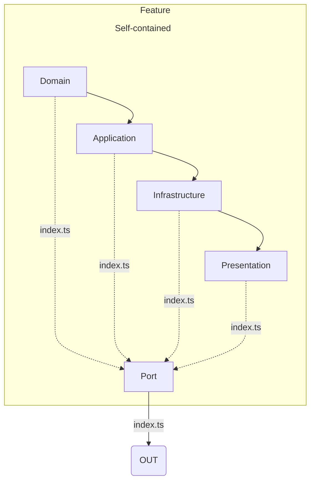
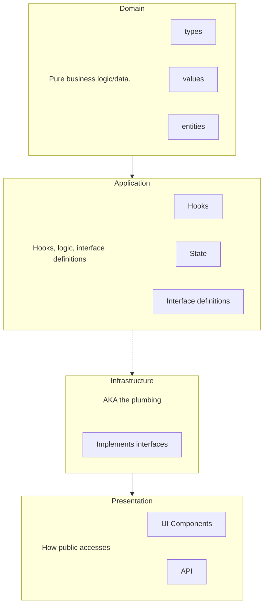

# Architecture Rules

## System Overview
- **Architecture Pattern**: Modular Monolith with Component-Driven Development (CDD).
- **Goal:** Build once, use anywhere.
- **Design Principles**: Strict Separation of Concerns (SoC) within modules, Hexagonal (Ports out of modules & Adapters), Clean Architecture.
- **Why Modular Monolith**: Max reusability, testability, and modularity. It isolates complexity. Can extract a feature folder into a reusable package later without refactoring the entire codebase. 0
- **Rule of Thumb**: "The brain (logic) never knows about the face (UI)."

## Pattern To Follow
1. Every feature/business capability must be organized in a self-contained **Module**.
2. **Every Module is self-contained:** It owns its presentation, logic, and data. 
3. **Logic is separate from data and presentation:** Every module splits concerns into the following layers: Domain, Application, Infrastructure, Presentation. (See [Layer Dependencies](#layer-dependencies-inside-a-module))
4. Can have a small, strictly controlled shared module for common utilities that all modules can use (e.g. `/shared`, `utils` for generic helpers, logging, generic error handling). It CANNOT contain business logic. Cannot import from any other internal module.
5. Abstract logic: Extract and move complex logic into a reusable package ( e.g. `packages/hooks`). These must have zero UI dependencies.
6. Code MUST follow `code-style.md` rules. 
7. Cross-module interaction is strictly through "Ports": (e.g. defined interfaces, coordinator pattern, public events).
8. Modules must use a single "Port" to centralize, inject, and wire external dependencies. (E.g. `module.ts` file, `Namespace\MyModuleName\Module::Port`, etc.)

See Pattern Diagram below: 



### Forbidden Patterns
- No circular dependencies
- **No direct database calls.** Data access must be through defined interfaces (unless Infrastructure). Direct database calls must be centralized in the Infrastructure layer for a centralized source of truth. 
- **No cross-module direct access:** Any cross-module interaction happens strictly through defined interfaces, coordinator pattern, public events. 
- **Modules cannot inherit each other:** They must be self-contained and own its data, logic, and presentation.

## The Structure

Here are some examples of what this may look like.
```bash
src/modules/<feature-name> 
├── <domain layer>/           # [CORE] Pure business logic, entities, values. NO external deps.
├── <application layer>/      # [CORE] Use cases, orchestration, ports (interfaces).
├── <infrastructure layer>/   # [OUTSIDE] DB, API clients, file system, 3rd party libs.
├── <presentation>/     # [OUTSIDE] UI Components, Pages, Hooks, CSS.
├── index.ts          # [PUBLIC] Only exported API for this module.
└── module.ts         # [INTERNAL] Dependency injection wiring.
```

```bash
src/<module>/<feature-name>
├── <domain layer>/           # [CORE] Pure business logic, entities, values. NO external deps.
├── <application layer>/      # [CORE] Use cases, orchestration, ports (interfaces).
├── <infrastructure layer>/   # [OUTSIDE] DB, API clients, file system, 3rd party libs.
├── <presentation>/     # [OUTSIDE] UI Components, Pages, Hooks, CSS.
├── index.ts          # [PUBLIC] Only exported API for this module.
└── module.ts         # [INTERNAL] Dependency injection wiring. (if needed)

```

## Module Definitions & Boundaries
- Organize by feature or vertical slice instead of type. 
- Do not group by technical type (e.g., no global `controllers/` folder).
- Every feature/business capability must be a self-contained **Module**.

**Criteria for a Valid Module:**
- **Business Domain:** Does it own a specific business concept (e.g., `Billing`, `AssetManagement`, `UserAuth`, `DesignSystem`)?
- **Feature:** Does it own a feature that allows user to do a specific thing repeatable? (e.g. Adding and configuring extensions.)
- **Self-Contained Data:** Can it own its own data / logical namespace? 
- **Self-Contained Logic:** Does it contain all the rules necessary to perform its job without asking another module to "do the math"?


| Example           | Module? | Why                                                           |
| ----------------- | ------- | ------------------------------------------------------------- |
| `DesignSystem`    | Yes     | Handles design tokens, generating theme.json and token output |
| `BackupUtility`   | Yes     | Handles scheduling, compression, remote storage logic         |
| `DatabaseHelper`  | No      | Infrastructure                                                |
| `HeaderComponent` | No      | Presentation                                                  |
|                   |         |                                                               |


## Layer Dependencies (Inside A Module)


### 1. Domain / ("The Brain")
Contains: Entities, Value Objects, Domain Events, Pure Business Rules.
**Rules:**
- Functions must be deterministic (same input = same output). (E.g. SetAttribute, SetAttributeValue, GetBlockProps)
- CANNOT: Depend on any other folder.
- MAY: Use `/shared` helpers
- MAY: Compose convenience functions from existing internal functions (E.g. GetBlockAttribute uses GetBlockProps.attribute(someName))

Example: User, EmailValueObject, calculateDiscount().

### 2. Application / (The "Orchestrator")
**Contains:** Use Cases (Interactors), Input/Output Ports (Interfaces), DTOs.
**Rules:**
- MAY depend on domain/.
- MUST define interfaces (Ports) for data access, but NEVER implement them here. (E.g. Defines the DropdownConfig and DropdownOptions interfaces)
- MUST NOT import infrastructure/ or presentation/ directly (Dependency Inversion).

Example: UserRepositoryPort (interface).

### 3. Infrastructure/ (The "Plumbing")

**Contains:** Database repositories, External API clients, File writers, Auth providers, etc.
**Rules:**
- MUST: implement interfaces defined by Application layer (E.g.  )
- MAY: Directly run database queries.
- MAY: depend on domain/ and application/. (E.g. )
- NEVER: export infrastructure classes directly to presentation/.

### 4. Presentation ("The Face")
**Contains:** Reusable jsx components, template structures (html, .twig), design, CLI menu, public API. 
**Rules:**
- MUST: Depend on Application layer 
- NEVER: Contain logic or rendering functions within UI components.
- MUST: Follow component-driven design.
- MUST: Allow modular reuse of atomic components within larger structures.
- MAY: Assemble a pre-built component composed of an atomic component and an Interface. (E.g. a configurable DropDownField from a Select component that uses the DropdownConfig interface. ) 


## Data Flow
`Presentation` depends on `Application`.
    -   `Application` depends on `Domain`.
    -   `Infrastructure` depends on `Domain` (to implement interfaces).
    -   _Never_ let `Domain` know about `Infrastructure` or `Presentation`.

### Interaction Rules

| Source Layer       | Target Layer       | Allowed?  | Rule                                  |
| :----------------- | :----------------- | :-------- | :------------------------------------ |
| **Presentation**   | **Domain**         | ❌ **NO**  | Must go through Application.          |
| **Presentation**   | **Infrastructure** | ❌ **NO**  | Must go through Application.          |
| **Application**    | **Domain**         | ✅ **YES** | Standard flow.                        |
| **Application**    | **Infrastructure** | ✅ **YES** | To execute commands (via Interfaces). |
| **Domain**         | **Application**    | ❌ **NO**  | Domain is the top of the stack.       |
| **Domain**         | **Infrastructure** | ❌ **NO**  | Domain only sees Interfaces.          |
| **Module A**       | **Module B**       | ❌ **NO**  | Must use Interface or Event.          |
| **Infrastructure** | **Database**       | ✅ **YES** | Only Infrastructure touches the DB.   |


