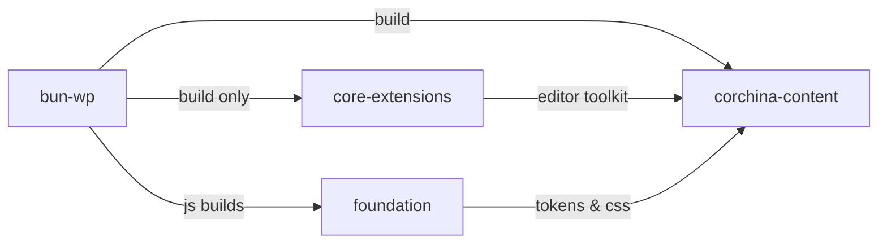

# Architecture audit: {Scope}

**Date:** {{YYYY-MM-DD}}
**Scope:** `{{hyperlinked filepath}}`
**Goal:** {{Concise, single sentence}}
<!--Example: Align to `rules/code-style.md` + `rules/frontend.md`, preserve functionality, strip overengineering. -->

**Excluded from this report:**

- {{Bulleted list of exclusions, if applicable}}

---

> [!NOTE] TLDR 📍
> No more than three sentences

**Jump ahead:**
<!---Clickable table of contents --->

1. {{H2s only}}
2. {{Proposal}}
3. {{Appendix}}

## Overview

<!---Summary table of what works and what was flagged, by domain area-->

| Domain                     | Verdict         |                 |
| -------------------------- | --------------- | --------------- |
| {{area of the code base }} | {{🟢 or   🚩 }} |                 |
| {{area of the code base }} |                 | {{🟢 or   🚩 }} |

**What works:**

- {{Bulleted list of what's working. Keep it short. }}
- {{ Another bullet point}}

**What doesn't work:**
<!---Summarize issues in a high-level table-->

| Violation     | Issue                       | Violates                                              |
| ------------- | --------------------------- | ----------------------------------------------------- |
| {{The issue}} | {{Brief, only a few words}} | {{What architecture/code style rule does it violate}} |

<!--Short writeup of the themes above here-->

1.  **{{Major theme.}}** {{1-2 sentence statement}}.
2.  **{{Major theme.}}** {{1-2 sentence statement}}.

---

## Proposal

<!--Table of contents with anchor links to each major subhead here-->

**Jump ahead:**

1. {{Change 1}}
2. {{Change 2}}
3. {{Change 3}}
4. [Recommended order|anchor/to/section]

<!--Format for Change H3-->

### {{Change }}

> [!NOTE] Why
> {{Reasoning }}

**What changes**:

- {{Briefly list the high-level changes}}
- {{Example: Package A drops Package B entirely}}

**What it fixes:**

- {{High level impact of this change}}
- {{Example: Package A doesn't have to load CSS tools it doesn't need from Package B }}

<!---illustrate the filetree, if relevant-->

```
New filetree structure, if relevant
```

<!---Use mermaid diagram to illustrate any changes to flow--->

**Resulting graph:**



<!---If there's a tradeoff we're making with this change, outline it here in a table--->

**Tradeoffs:**

| What                          | Size                                                                               | Why       |
| ----------------------------- | ---------------------------------------------------------------------------------- | --------- |
| {{One-line of the trade off}} | {{E.g. how big of a tradeoff is it? Minor inconvenience? What am I sacrificing? }} | {{Notes}} |

---

### Recommended order

| **Order** | **Fix**                                                            | **Solves**                                                                                                       | **Why**                 |
| --------- | ------------------------------------------------------------------ | ---------------------------------------------------------------------------------------------------------------- | ----------------------- |
| 1         | Add `tests/` for the pure functions (filter names, schema lookup). | • **\#NN**: {Brief headline of the relevant issue}[anchor/link/to/refactor/report/number]<br>• **#NN:**[Headline | #anchor/link/to/report] | {{Reasoning for tackling this in this order}}<br> |
| 2         | {{Fix}}                                                            | {{Issue/ssues}}                                                                                                  | {{Reasoning}}           |

## Refactor report (Full appendix)

| #   | Scope                      | Impact                                                       | What to refactor                 | Why                                        | What it fixes              |
| --- | -------------------------- | ------------------------------------------------------------ | -------------------------------- | ------------------------------------------ | -------------------------- |
| 1   | {{Area of the code base }} | {{Impact this refactor will have, use emojis to illustrate}} | {{One-line, what's we're doing}} | {{ Why we're doing it. Two sentences max}} | {{Benefit of this change}} |
