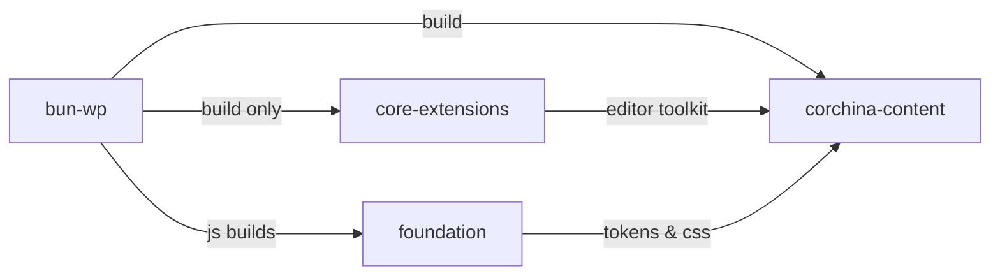

# Refactor report: {Scope}

**Date:** {{YYYY-MM-DD}}
**Scope:** `{{hyperlinked filepath}}`
**Goal:** {{Concise, single sentence}}

---

> [!NOTE] TLDR 📍
> {{No more than three sentences}}

**Jump ahead:**
<!---Clickable table of contents --->

1. {{H2s only}}
2. {{Priority refactors}}
3. {{End state}}

## SOLID Scorecard Overview
{{Statuses: OK 🟢; Warning 🟡; Violation 🔴}}

<!--Always include a summary table following this format-->
| Principle | Status | Issues Found |
|-----------|--------|--------------|
| Single Responsibility | 🟡 | 3 large classes |
| Open/Closed | 🟢 | OK |
| Liskov Substitution Principle | 🟢 | OK |
| Interface Segregation | 🔴 | 2 fat interfaces |
| Dependency Inversion | 🟡 | 5 direct instantiations |

<!--Should briefly expand on any noticeable, consistent issues found. -->
**Common themes:**
1.  **{{Major theme.}}** {{1-2 sentence statement }}.
2.  **{{Major theme.}}** {{1-2 sentence statement}}.
3.  {{etc}}

<!--Optional: Any suggestions to avoid repeating these issues in the future for other parts of the codebase. These should be actionable right away. (E.g. implementing a script that checks for x, SOP changes, frameworks, etc.) -->
**Takeaways:**
---


## Priority refactors 🎯
All issues, ranked and grouped by importance and impact.
Bold any items that are quick wins—low effort, high impact.
| **#**   |**Category**| **Where** | **Problem** |**Recommendation**|                         **Impact**|**Effort**|
|--|--|---|--|---|---|--|
|{{Number}} |{{SCORE Violation Category}}|{{Area of the code base}} | One-line, what's the issue. | {{ The suggested fix, the benefit of the change.}}|{{High, Med, Low}}|{{High/Med/Low}}|

### 1. [Highest Impact] - {{One-line, proposed action}}

**Violation**: Single Responsibility
**Current**: 450 lines handling auth + profile + notifications
**Suggested**:
<!--Diagram or brief code snippet of the change-->
<example>
```
UserService.ts (450 lines)
    ↓ Extract
AuthService.ts (~150 lines)
ProfileService.ts (~150 lines)
NotificationService.ts (~100 lines)
```
</example>

**Risk**: Medium (update imports)
**Tests Needed**: Update dependency injection in tests

### 2. [Second Priority] - {{One-line, proposed action}}

**Location**: `src/handlers/payment.ts:45`
**Current**:
```typescript
switch (paymentType) {
  case 'card': // 50 lines
  case 'bank': // 50 lines
  case 'crypto': // 50 lines
}
```
**Suggested**: Strategy pattern with `PaymentProcessor` interface
**Risk**: Low (isolated change)

## Code Smells (Seems Sus) 🐍

| Smell | Location | Severity |
|-------|----------|----------|
| Long Method | `api.ts:calculateTotal` (120 lines) | 🟠 High |
| Duplicate Code | `utils/*.ts` (3 similar blocks) | 🟡 Medium |
| Deep Nesting | `parser.ts:parse` (6 levels) | 🟡 Medium |

## Quick Wins (Low Risk, High Value) 🏆

1. Extract `validateEmail()` to shared utils (used in 4 places)
2. Replace magic numbers with named constants
3. Add early returns to reduce nesting in `processOrder()`

## Technical Debt Notes 🏦

- {{Items to add to Parking Lot}}


## End state
{{Illustrate with a filetree or mermaid doc, if relevant, about any changes to structure or flow}}

<example>
**Resulting graph:**


</example>

**What changes**:

- {{Briefly list the high-level changes}}
- {{Example: Package A drops Package B entirely}}

**What it fixes:**

- {{High level impact of this change}}
- {{Example: Package A doesn't have to load CSS tools it doesn't need from Package B }}